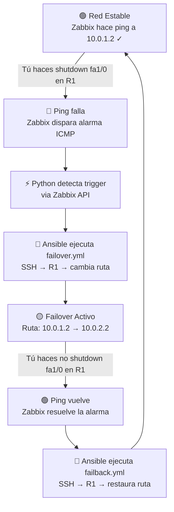

# 🔄 Guía Paso a Paso — Proyecto Failover desde Cero

> Esta guía asume que estás en una máquina con Docker, Docker Compose y GNS3 instalados.
> Todas las IPs son las **exactas** que usa tu código. No cambies ninguna.

---

## Mapa de IPs (Referencia Rápida)

| Dispositivo | Interfaz | IP | Máscara | Propósito |
|---|---|---|---|---|
| **Tu PC (Docker)** | `br-xxxxx` | `10.50.0.1` | `/16` | Gateway de la red Docker |
| **R1** | `FastEthernet0/0` | `10.50.0.100` | `255.255.0.0` | Management (SSH + SNMP) |
| **R1** | `FastEthernet1/0` | `10.0.1.1` | `255.255.255.0` | Enlace PRINCIPAL → R2 |
| **R1** | `FastEthernet1/1` | `10.0.2.1` | `255.255.255.0` | Enlace RESPALDO → R2 |
| **R2** | `FastEthernet1/0` | `10.0.1.2` | `255.255.255.0` | Enlace PRINCIPAL ← R1 |
| **R2** | `FastEthernet1/1` | `10.0.2.2` | `255.255.255.0` | Enlace RESPALDO ← R1 |

> [!IMPORTANT]
> - `fa0/0` de R1 usa máscara `255.255.0.0` (red grande `/16` de Docker)
> - `fa1/0` y `fa1/1` de ambos routers usan máscara `255.255.255.0` (redes chicas `/24`)
> - **Nunca mezcles las máscaras** o Cisco te dará error "overlaps"

---

## PASO 1 — Limpiar todo (si ya tenías algo corriendo)

```bash
cd ~/REDES/Proyecto_Failover
docker compose down -v
```

El `-v` borra los volúmenes (base de datos de Zabbix, estado del motor, todo). Así empiezas limpio.

---

## PASO 2 — Levantar los contenedores

```bash
docker compose up -d --build
```

Espera ~2-3 minutos. Verifica que todo esté `healthy`:

```bash
docker compose ps
```

Deberías ver 5 contenedores corriendo: `zabbix-db`, `zabbix-server`, `zabbix-web`, `zabbix-agent`, `automation-engine`.

---

## PASO 3 — Identificar la interfaz Docker para GNS3

Necesitas saber qué interfaz de red usa Docker para la red `10.50.0.0/16`. Ejecuta:

```bash
ip addr | grep "10.50.0.1/"
```

Te saldrá algo como:
```
inet 10.50.0.1/16 ... br-e3f91ab1646d
```

**Anota ese nombre** (ej: `br-e3f91ab1646d`). Lo necesitarás para el nodo Cloud en GNS3.

---

## PASO 4 — Crear la topología en GNS3

### 4.1 Arrastra los dispositivos
1. Arrastra **2 routers Cisco** al workspace (R1 y R2)
2. Arrastra **1 nodo Cloud**

### 4.2 Configurar el Cloud
1. Doble clic en el nodo Cloud
2. En la pestaña de interfaces, busca y selecciona la interfaz `br-xxxxxxx` que anotaste en el Paso 3
3. Dale "Add" y luego "OK"

### 4.3 Conectar los cables (3 cables en total)

| Cable | Desde | Hasta |
|---|---|---|
| **Cable 1** (management) | Cloud `br-xxxxx` | R1 `FastEthernet0/0` |
| **Cable 2** (enlace principal) | R1 `FastEthernet1/0` | R2 `FastEthernet1/0` |
| **Cable 3** (enlace respaldo) | R1 `FastEthernet1/1` | R2 `FastEthernet1/1` |

### 4.4 Encender ambos routers
Click derecho → Start en cada router.

---

## PASO 5 — Configurar R1 (copiar y pegar en consola)

Abre la consola de R1 (doble clic) y pega **todo este bloque**:

```
enable
configure terminal

hostname R1
ip domain-name lab.uagrm
crypto key generate rsa modulus 1024
username admin privilege 15 password cisco

line vty 0 4
 login local
 transport input ssh
exit

interface FastEthernet0/0
 ip address 10.50.0.100 255.255.0.0
 no shutdown
exit

interface FastEthernet1/0
 ip address 10.0.1.1 255.255.255.0
 no shutdown
exit

interface FastEthernet1/1
 ip address 10.0.2.1 255.255.255.0
 no shutdown
exit

ip route 0.0.0.0 0.0.0.0 10.0.1.2

snmp-server community public RO

end
write memory
```

> [!NOTE]
> Si te pregunta el tamaño de la clave RSA, escribe `1024` y dale Enter.
> Si te dice "Overwrite?", escribe `yes` o dale Enter.

---

## PASO 6 — Configurar R2 (copiar y pegar en consola)

Abre la consola de R2 y pega **todo este bloque**:

```
enable
configure terminal

hostname R2

interface FastEthernet1/0
 ip address 10.0.1.2 255.255.255.0
 no shutdown
exit

interface FastEthernet1/1
 ip address 10.0.2.2 255.255.255.0
 no shutdown
exit

ip route 10.50.0.0 255.255.0.0 10.0.1.1

end
write memory
```

> [!IMPORTANT]
> La línea `ip route 10.50.0.0 255.255.0.0 10.0.1.1` es **crítica**.
> Sin ella, Zabbix le hace ping a R2 y el ping llega, pero R2 no sabe cómo responder de vuelta hacia Docker, así que el ping "se pierde" y Zabbix siempre dirá que el router está caído.

---

## PASO 7 — Verificar conectividad

### 7.1 Desde R1, hacer ping a tu PC (Docker gateway):
```
ping 10.50.0.1
```
**Esperado:** `!!!!!` (5 de 5 exitosos)

### 7.2 Desde R1, hacer ping a R2 por enlace principal:
```
ping 10.0.1.2
```
**Esperado:** `!!!!!`

### 7.3 Desde R1, hacer ping a R2 por enlace respaldo:
```
ping 10.0.2.1
```
**Esperado:** `!!!!!`

### 7.4 Desde tu terminal Ubuntu, verificar que Docker llega a R1:
```bash
docker exec automation-engine ping 10.50.0.100 -c 4
```
**Esperado:** 4 paquetes recibidos, 0% loss.

### 7.5 Desde tu terminal Ubuntu, verificar SSH:
```bash
docker exec automation-engine ssh -o StrictHostKeyChecking=no admin@10.50.0.100
```
**Esperado:** Te pide password (`cisco`), entras y ves el prompt `R1#`.
Escribe `exit` para salir.

> [!WARNING]
> Si el ping del paso 7.4 falla con "Destination Host Unreachable", prueba hacer primero el ping desde R1 hacia `10.50.0.1` (paso 7.1). Si también falla, borra el cable del Cloud a R1 en GNS3 y vuélvelo a conectar. Luego repite.

---

## PASO 8 — Inyectar rutas en el contenedor Zabbix Server (AUTOMATIZADO)

¡Buenas noticias! Este paso ha sido **completamente automatizado**. Hemos añadido un servicio ligero de inicialización llamado `zabbix-route-init` en `docker-compose.yml` que comparte el namespace de red de `zabbix-server`. Este se encarga de inyectar las rutas estáticas (`10.0.1.0/24` y `10.0.2.0/24`) a `zabbix-server` automáticamente al arrancar. Ya no tienes que instalar `iproute2` ni ejecutar comandos de Docker manualmente en cada reinicio.

Si deseas verificar que las rutas se agregaron correctamente, puedes ver los logs del contenedor de inicialización:
```bash
docker compose logs zabbix-route-init
```
O bien ejecutar la verificación manual en el servidor Zabbix:
```bash
docker exec zabbix-server ip route
```

---

## PASO 9 — Configuración de Zabbix (AUTOMATIZADO)

¡Este paso también ha sido **completamente automatizado**! Ya no necesitas registrar manualmente el Host Group, el Host, asociar la plantilla `ICMP Ping`, ni crear la acción en la interfaz web de Zabbix.

### ¿Cómo funciona la automatización?
Cuando levantas la infraestructura con `docker compose up`, el contenedor `automation-engine` ejecutará `main.py`, el cual espera a que la API de Zabbix esté lista y realiza automáticamente lo siguiente:
1. Crea el **Host Group** llamado `GNS3 Routers` (si no existía).
2. Busca la plantilla oficial de Zabbix **`ICMP Ping`**.
3. Registra el host **`Router-R1-GNS3`** asociándole la plantilla `ICMP Ping` y configurando su IP de monitoreo exactamente en **`10.0.1.2`** (el extremo de R2 a través del enlace principal). Si el host ya existía, actualiza su interfaz para asegurar que tiene esta IP correcta.
4. Crea la **Acción de Failover** en Zabbix para alertar ante fallas de ICMP.

> [!IMPORTANT]
> **¿Por qué la IP de monitoreo es `10.0.1.2` y no `10.50.0.100`?**
> Porque queremos que Zabbix le haga ping a R2 **a través del enlace principal**.
> Si el enlace principal se cae, el ping a `10.0.1.2` fallará, Zabbix disparará la alarma, y tu motor de automatización detectará la alarma y ejecutará el failover.
> Si usáramos `10.50.0.100` (IP de management), Zabbix le haría ping a R1 por la interfaz de management (que nunca se cae), y jamás se enteraría de la falla del enlace principal.

### 9.1 Verificar en Zabbix Web o en los logs del motor
1. Abre tu navegador: **http://localhost:8080**
2. Inicia sesión: **Admin** / **zabbix**
3. Ve a `Monitoring` → `Hosts` y verás que el host `🌐 Router-R1-GNS3` ya ha sido creado y está siendo monitoreado de forma automática.
4. Si quieres ver el flujo de arranque del motor de automatización y la auto-configuración exitosa, mira sus logs:
```bash
docker compose logs -f automation-engine
```
Deberías ver una salida limpia como esta:
```
⚙ Iniciando auto-configuración de Zabbix...
  ✓ Host Group 'GNS3 Routers' creado o ya existente
  ✓ Host 'Router-R1-GNS3' registrado automáticamente (ID: 10084, IP de monitoreo: 10.0.1.2)
  ✓ Acción 'Failover - ICMP Ping Failed' creada o ya existente
✓ Auto-configuración de Zabbix completada con éxito.
...
✓ Red estable — Monitoreando...
```

**¡Si ves ese mensaje, todo está listo para la demostración!**

---

## PASO 10 — Demostración: Simular la caída

### ¿Cómo simular la falla?

**Usa `shutdown` en la consola del router R1.** Es lo más confiable.

> [!WARNING]
> **¿Por qué NO usar "Suspend link" en GNS3?**
> En muchas versiones de GNS3, "Suspend" solo está disponible si abres el menú del cable directamente, y a veces el cable no lo permite dependiendo del tipo de nodo Cloud que uses. Usar `shutdown` en la consola es 100% confiable y produce el mismo efecto.

### 10.1 Cortar el enlace principal
En la consola de R1:
```
enable
configure terminal
interface FastEthernet1/0
 shutdown
end
```

### 10.2 Observar los logs
En tu terminal Ubuntu, mira los logs en tiempo real:
```bash
docker compose logs -f automation-engine
```

**En ~1-2 minutos verás:**
```
⚠ Trigger activo: ICMP Ping: Unavailable by ICMP ping
============================================================
  ¡FALLA CRÍTICA DETECTADA! Iniciando FAILOVER
============================================================
✓ FAILOVER #1 completado
  Ruta cambiada: 10.0.1.2 → 10.0.2.2
```

### 10.3 Verificar en el router
En la consola de R1, confirma que la ruta cambió automáticamente:
```
show ip route static
```
Deberías ver que ahora la ruta default apunta a `10.0.2.2` (respaldo) en lugar de `10.0.1.2` (principal).

### 10.4 Restaurar el enlace (Failback)
En la consola de R1:
```
enable
configure terminal
interface FastEthernet1/0
 no shutdown
end
```

**En ~1-2 minutos verás en los logs:**
```
============================================================
  Enlace principal restaurado — Iniciando FAILBACK
============================================================
✓ FAILBACK #1 completado
  Ruta restaurada: 10.0.2.2 → 10.0.1.2
✓ Red estable — Monitoreando...
```

---

## Resumen del Flujo Completo



---

## Troubleshooting Rápido

| Síntoma | Causa | Solución |
|---|---|---|
| Ping de R1 a `10.50.0.1` falla | GNS3 bugeado | Borrar cable Cloud↔R1 en GNS3 y reconectarlo |
| Zabbix siempre rojo | Falta ruta en zabbix-server | Ejecutar el comando del Paso 8 |
| Zabbix siempre rojo (2) | R2 no tiene ruta de retorno | Verificar `ip route 10.50.0.0 255.255.0.0 10.0.1.1` en R2 |
| Ansible falla con "No route to host" | Docker no ve a R1 | Ping desde R1 hacia `10.50.0.1` para forzar ARP |
| Motor dice "FAILOVER FALLÓ" repetidamente | Estado corrupto | Resetear estado (ver abajo) |
| "overlaps" al configurar R2 | Máscara equivocada | Usar `255.255.255.0` en fa1/0 y fa1/1, **no** `255.255.0.0` |

### Resetear estado del motor (si se queda atascado):
```bash
docker compose exec automation-engine python3 -c "import json; json.dump({'en_failover':False,'total_failovers':0,'total_failbacks':0,'last_failover_at':None,'last_failback_at':None,'last_check_at':None,'consecutive_errors':0,'engine_started_at':'now'}, open('/app/data/engine_state.json','w'))"
```


docker compose exec automation-engine python3 -c "
import json
json.dump({
  'en_failover': False,
  'total_failovers': 0,
  'total_failbacks': 0,
  'last_failover_at': None,
  'last_failback_at': None,
  'last_check_at': None,
  'consecutive_errors': 0,
  'engine_started_at': 'now'
}, open('/app/data/engine_state.json','w'))
print('Estado reseteado')
"


docker exec --user root zabbix-server bash -c \
  "ip route add 10.0.1.0/24 via 10.50.0.100 2>/dev/null; \
   ip route add 10.0.2.0/24 via 10.50.0.100 2>/dev/null; \
   echo '✓ Rutas listas'"
   
   
   
   
   
   
   
   docker exec zabbix-server ping 10.0.1.2 -c 3
docker exec zabbix-server ping 10.0.2.2 -c 3
